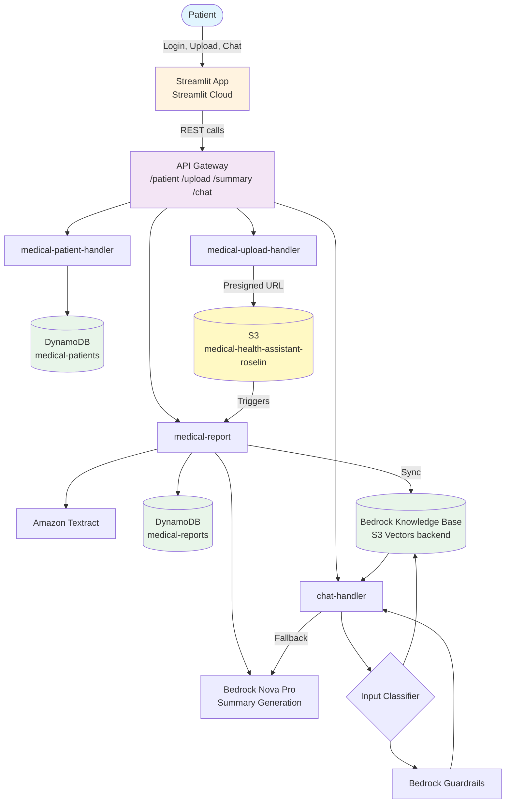

# 🏥 Medical Health Assistant

An AI-powered assistant that helps patients understand their blood test reports. Patients upload a PDF report, get an AI-generated summary with critical values automatically flagged, and can ask follow-up questions through a RAG-based chatbot — with every chat answer backed by a source citation from their own report.

Built as a hands-on AWS/AI portfolio project during a career transition into cloud and AI engineering.

---
🔗 **Live App:** [medical-health-assistant-g8gkdydgzsbjs5xlumhsyf.streamlit.app](https://medical-health-assistant-g8gkdydgzsbjs5xlumhsyf.streamlit.app/)

## Architecture



**Core components**

| Layer | Service | Purpose |
|---|---|---|
| Frontend | Streamlit (Streamlit Cloud) | Login, upload, summary view, chat UI |
| API | API Gateway (Lambda Proxy Integration) | `/patient`, `/upload`, `/summary`, `/chat` |
| Compute | AWS Lambda (4 functions) | Business logic, isolated per concern |
| Storage | S3 | Raw uploaded PDF reports |
| OCR | Amazon Textract | Extracts text from uploaded PDFs |
| AI | Bedrock Nova Pro | Generates plain-language summaries; powers chat fallback |
| Retrieval | Bedrock Knowledge Base (S3 Vectors) | RAG backend for chat Q&A |
| Safety | Bedrock Guardrails | Blocks medication advice, diagnosis, self-harm, off-topic content |
| Database | DynamoDB (`medical-reports`, `medical-patients`) | Report storage, stable patient identity |

---

## Features

- **Upload & summarize** — upload a blood report PDF, get Textract-extracted values and an AI-generated plain-language summary, with abnormal values flagged.
- **Stable patient identity** — returning patients (by email) always get the same patient ID, so their report history persists across sessions.
- **RAG-based chat** — ask questions about your report; answers are grounded in the actual uploaded document via a Bedrock Knowledge Base, not the model's general knowledge.
- **Source citations** — every KB-grounded chat answer includes an expandable "Source" section showing the exact report text the answer was based on.
- **Guardrailed fallback** — questions outside the report's scope (general health guidance) get a safe, scoped answer; questions asking for diagnosis or medication advice are blocked by Bedrock Guardrails.
- **Report caching** — re-processing an already-summarized report returns the cached result instead of re-running Textract/Nova Pro.

---

## Problems Hit & Solutions

### 1. Numeric boundary values misjudged by the LLM
**Problem:** The model was unreliable at comparing tight numeric ranges — e.g. Eosinophils at 7% vs. a normal range of 0–6% was repeatedly misjudged as "normal."
**Root cause:** Letting the LLM reason about numeric comparisons directly is unreliable at tight margins.
**Fix:** Added a deterministic Python function (`extract_critical_values`) that pre-computes which values are out of range, and fed those as confirmed facts into the Nova Pro summary prompt — removing the model from the numeric judgment path entirely for the summary flow.
**Known limitation:** The same issue still exists in the chat flow, since `retrieve_and_generate` is a single black-box API call — pre-computed facts can't be injected into its internal reasoning the same way. Flagged as a planned improvement (see below).

### 2. Returning patients got a new random ID every login
**Problem:** Every login generated a fresh `PAT-XXXXXX`, even for the same email — breaking any notion of report history or "compare over time."
**Root cause:** Patient ID generation happened entirely client-side in Streamlit with no backend persistence or lookup.
**Fix:** Added a `medical-patients` DynamoDB table (PK: `email`) and a `medical-patient-handler` Lambda with `GET`/`POST /patient` endpoints. Streamlit now checks for an existing patient by email before creating a new one, instead of generating an ID locally.
**Side effect discovered:** This same bug had been silently breaking the report-caching logic (`check_existing_report`) — cache lookups were keyed on `patient_id`, which never matched across sessions. Fixing patient identity fixed caching too, without touching that code.

### 3. Chat answers had no explainability
**Problem:** Patients had no way to verify what part of their report a chat answer came from.
**Root cause:** `retrieve_and_generate`'s response already included `citations`, but the Lambda discarded them after using them only for an internal grounding check.
**Fix:** Added `extract_sources()` to pull and de-duplicate cited text chunks, returned them alongside the answer, and rendered them in Streamlit as an expandable "View Source" section.
**Known limitation:** Citations currently return the full retrieved chunk (e.g. the whole lab panel) rather than just the relevant line, since KB chunking wasn't done at a per-value granularity. Considered a keyword-window filter to highlight just the relevant text, but deferred — the full-chunk citation is still accurate and transparent, and effort was prioritized toward the numeric-boundary fix instead.

### 4. Idle cost from OpenSearch Serverless
**Problem:** OpenSearch Serverless (used as the original KB vector backend) had an idle-cost floor, running up charges even without traffic.
**Fix:** Migrated the Knowledge Base to an S3 Vectors backend — no idle-cost floor, cheaper for a low-traffic portfolio project.

### 5. Windows Application Control Policy blocking local testing
**Problem:** `streamlit run app.py` failed with `streamlit.exe` blocked by a Windows Application Control Policy.
**Fix:** Run via `python -m streamlit run app.py` instead — invokes Streamlit as a Python module rather than launching the blocked executable directly.

---

## Tech Stack

**Frontend:** Streamlit (Streamlit Cloud)
**Backend:** AWS Lambda (Python)
**API:** Amazon API Gateway (REST, Lambda Proxy Integration)
**Storage:** Amazon S3, Amazon DynamoDB
**AI/ML:** Amazon Textract (OCR), Amazon Bedrock (Nova Pro, Knowledge Bases, Guardrails), S3 Vectors
**IAM:** Inline policies scoped per-Lambda to minimum required actions

---

## Planned Improvements

- **Chat numeric-boundary fix** — add a DynamoDB lookup in `chat-handler` to cross-check the KB's numeric reasoning against pre-computed critical values, mirroring the fix already applied to the summary flow.
- **Chat history persistence** — new `medical-chat-history` table to store question/answer/session records per patient.
- **Finer-grained source citations** — filter cited chunks down to the relevant line rather than the full retrieved passage.
- **Tamil/English language toggle** for summaries and chat.
- **Notifications & automation (Phase 3):** SES email summaries, SNS critical-value alerts, SQS+DLQ between S3 and the report Lambda, EventBridge-driven follow-up reminders.

---

## Setup

1. Clone the repo and install dependencies: `pip install -r requirements.txt`
2. Create `.streamlit/secrets.toml` with:
   ```toml
   API_BASE_URL = "https://<your-api-id>.execute-api.<region>.amazonaws.com/prod"
   ```
3. Run locally: `python -m streamlit run app.py`
4. Backend (Lambdas, DynamoDB tables, S3 bucket, Bedrock KB/Guardrails) is provisioned separately in AWS — see architecture diagram above for the full component list.
